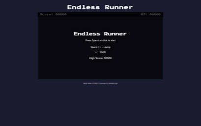
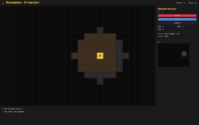
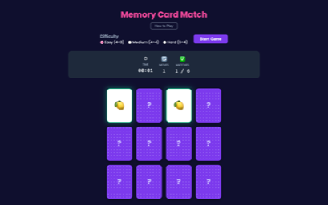

# Vibe Coding for Students 2026

A collection of web-based games for students learning to vibe-code with AI.

## What is this?

This is a monorepo where each student project lives in its own folder. Projects are built with HTML, CSS, and JavaScript — no frameworks, no build tools, just code.

## Getting Started

1. Tell Copilot what you want to build — it'll create the project folder for you.
2. Describe features in plain English and watch your site come to life.
3. Preview your project in the browser to see the results.

## Previewing Your Project

Open `index.html` directly in your browser, or start the website from the repository root:

```bash
python3 server.py
```

Then visit `http://localhost:5500/your-project-folder`.

## Games

| Preview | Project | Description |
|---------|---------|-------------|
|  | [endless-runner](endless-runner/README.md) | Side-scrolling character dodging obstacles with high score tracking |
|  | [dungeon-crawler](dungeon-crawler/README.md) | Grid-based dungeon exploration with turn-based combat and loot |
|  | [memory-card-match](memory-card-match/README.md) | Classic card-matching memory game with timer and difficulty levels |
